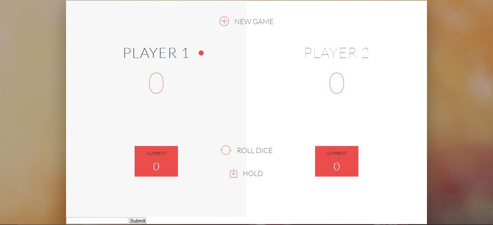

# Dice-Game

A Dice game that allows users to compete vs eachother. Player can set the goal target by entering a number within bottom left of the screen.

Then users can roll the dice, and can press hold to save their current score and grant the opposing player an opportunity to roll. Or they can roll the dice and risk hitting 1 or double 6, as both will result in losing the players turn.

